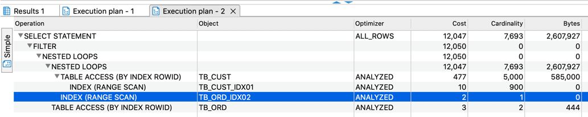

# chapter 03 조인 튜닝
> 오라클에서 제공하는 조인인 중첩 루프 조인, 해시 조인의 튜닝 기법에 대해 알아보자

## 3.1 중첩 루프 조인

### 3.1.1 중첩 루프 조인
* 중첩 루프 조인 이란? 
  * 프로그래밍에서 중첩 반복문과 같음
  * 반복문을 돌며 데이터를 한건 한건 식 찾아나가기때문에 대용량 테이블을 중첩 루프조인한다면 성능에 큰 부하를 줌. 

### 3.1.2 Outer 테이블과 Inner 테이블
* Outer 테이블 
  * 중첩루프조인에서 가장 먼저 스캔하는 테이블. Driving 테이블이라고도 함. 
  * 스캔 건수가 적을수록 중첩 루프 조인 시 유리
* Inner 테이블
  * 중첩 루프 조인에서 두 번째로 스캔하는 테이블. Driven 테이블이라고도 함. 
  * Outer 테이블보다 결과 건수가 많아야 중ㅊ첩 루프 조인 시 유리함.
  * Inner 테이블을 스캔할 때 효율적인 인덱스 스캔해야 테이블 풀스캔을 하지 않음. 

### 3.1.3 인라인 뷰
* 인라인 뷰 : FROM 절 내에 소괄호 '()'로 감싸져 있는 SELECT문
* 아래 쿼리에서 B 
```sql
SELECT *
  FROM DEP A, 
      ( SELECT DEPNO
          FROM EMP
      ) B,
 WHERE A.DEPNO = B.DEPNO
```
* View Merging : 옵티마이저가 집합 B를 A 테이블과 같은 레벨로 올라가도록 병합하는 것.
  * 같은 경로에 존재하면 옵티마이져는 더 많은 접근 경로를 통해 다양한 실행 계획들을 비교하고 평가하게 되므로 최적의 실행 계획을 도출해낼 수 있음.  
* View No Merging : View Merging와 반대로 같은 레벨로 올라가지 않도록 하는 것. 

### 3.1.4 중첩 루프 조인 튜닝
* 중첩 루프 조인 튜닝
  * Outer 테이블의 결과 집합이 작도록 함
  * Inner 테이블 스캔 시 반드시 효율적인 인덱스 스캔이 이루어지도록 함 

### 3.1.5 중첩 루프 조인 튜닝 관련 힌트
* LEADING
  * 2개 이상의 테이블 조인 시 첫 번째로 스캔하는 테이블을 지정하는 힌트
  ```sql
  SELECT /*+ LEADING(테이블) */
  ```

  * DEPT 테이블을 선행 테이블로 지정. 
  ```sql
  SELECT /*+ LEADING(A) */
         *
    FROM DEPT A, 
         EMP B
   WHERE A.DEPTNO = 10
     AND A.DEPTNO = B.DEPTNO;
  ```
  
* USE_NL 
  * 중첩 루프 조인을 유도하는 힌트로 Inner Table을 지정하여 중첩 루프 조인을 수행
  ```sql
  SELECT /*+ USE_NL(테이블) */
  ```  
  * ACCOUNTS 테이블을 Outer 테이블로 지정하고 CUSTOMERS 테이블을 Inner 테이블로 지정하여 중첩 루프 조인 연산 수행
  ```sql
  SELECT /*+ LEADING(ACCOUNTS) USE_NL(CUSTOMERS) */
        ACCOUNT.BALANCE, 
        CUSTOMERS.LAST_NAME,
        CUSTOMERS.FIRST_NAME
    FROM ACCOUNTS,
         CUSTOMERS
   WHERE ACCOUNTS.CUSTNO = CUSTOMERS.CUSTNO;
  ``` 

  * MERGE 
    * 인라인 뷰로 감싸져 있는 SQL을 메인쿼리와 같은 레벨로 병합하는 역할, View Merging
    ```sql
    SELECT /*+ MERGE(뷰) */
    ``` 
    * 인라인 뷰인 V를 E1, E2 테이블과 같은 레벨이 되도록 View Merging -> 옵티마이저는 다양한 접근 경로 도출
    ```sql
    SELECT /*+ MERGE(V) */
          E1.NAME, E1.SAL, V.AVG_SAL
      FROM E1,
        (SELECT DEPTNO
              , AVG(SAL) as AVG_SAL
           FROM EMO E2
          GROUP BY DEPTNO) V
     WHERE 1 = 1
           E1.DEPTNO = V.DEPTNO AND
           E1.SAL > V.AVG_SAL 
    ``` 
  * NO_MERGE
    * 인라인 뷰로 감싸져있는 SQL이 메인 쿼리와 같은 레벨로 병합되는 것을 방지
    ```sql
    SELECT /*+ NO_MERGE(뷰) */
    ```
    * NO_MERGE 힌트를 사용하여 DALLASDEPT 뷰가 인라인 뷰에서 실행될 수 있도록 함.
    ```sql
    SELECT /*+ NO_MERGE(DALLASDEPT) */
          E1.ENAME,
          DALLASDEPT.DNAME,
      FROM EMP E1, 
          (SELECT DEPTNO, DNAME
             FROM DEPT
            WHERE LOC = 'DALLAS') DALLASDEPT -- 뷰 먼저 실행 후 뷰의 결과와 E1 테이블 조인 
     WHERE E1.DEPTNO = DALLASDEPT.DEPTNO;
    ```

## 실습 3-1 효율적인 중첩 루프 조인 결과 도출하기

### A-1) 테이블 생성

* TB_CUST 테이블 생성
```sql
DROP TABLE TB_CUST;
CREATE TABLE TB_CUST
(
    CUST_ID VARCHAR2(10), --고객ID
    CUST_NM VARCHAR2(50), --고객명
    BIRTH_DT VARCHAR2(8), --생일
    SEX VARCHAR2(2),  --성별
    PHONE_NO VARCHAR2(11), --폰번호
    JOIN_DT VARCHAR2(8), --가입일자
    INST_DTM DATE, --입력일시
    INST_ID VARCHAR2(50), --입력자ID
    UPDT_DTM DATE, --수정일시
    UPDT_ID VARCHAR2(50) -- 수정자ID
);
```

* TB_ORD 테이블 생성
```sql
DROP TABLE TB_ORD;
CREATE TABLE TB_ORD
(
    ORD_NO VARCHAR2(10), --주문번호
    ORD_DT VARCHAR2(8), --주문일자
    ORD_NM VARCHAR2(150), --주문이름
    ORD_AMT NUMBER(15), --주문금액
    PRDT_CD VARCHAR2(6), --상품코드
    SALE_GB VARCHAR2(2), --판매구분
    PAY_GB VARCHAR2(2), --결제구분
    CUST_ID VARCHAR2(10), --고객ID
    INST_DTM DATE, --입력시간
    INST_ID VARCHAR2(50), --입력자ID
    UPDT_DTM DATE, --수정시간
    UPDT_ID VARCHAR2(5) --수정자ID
);
```

### A-2) 데이터 입력

* TB_CUST 테이블에 데이터 입력
```sql
INSERT INTO TB_CUST
  SELECT LPAD(TO_CHAR(ROWNUM), 10, '0'),
         DBMS_RANDOM.STRING('U', 50),
         TO_CHAR(SYSDATE - TRUNC(DBMS_RANDOM.VALUE(3650, 36500)), 'YYYYMMDD'),
         LPAD(MOD(ROWNUM, 2), 2, '0'),
         LPAD(TO_CHAR(TRUNC(DBMS_RANDOM.VALUE(3650, 36500))), 11, '0'),
         TO_CHAR(SYSDATE - TRUNC(DBMS_RANDOM.VALUE(1, 365*3)), 'YYYYMMDD'),
         SYSDATE,
         'DBMSEXPERT',
         NULL,
         NULL
    FROM DUAL CONNECT BY LEVEL <= 100000;
```

* DUAL_10 테이블 생성하여 데이터 복제에 이용
```sql
CREATE TABLE DUAL_10
(
    DUMMY VARCHAR2(1)
)
;

INSERT INTO DUAL_10
SELECT DUMMY 
FROM DUAL CONNECT BY LEVEL <= 10;
```

* TB_ORD NOLOGGING 모드로 설정 후 데이터 100만건 입력
```sql
ALTER TABLE TB_ORD NOLOGGING;

INSERT /*+ APPEND */  INTO TB_ORD --APPEND 힌트 사용
SELECT
    LPAD(TO_CHAR(ROWNUM), 10, '0'),
    TO_CHAR(SYSDATE-TRUNC(DBMS_RANDOM.VALUE(1, 3650)), 'YYYYMMDD'),
    DBMS_RANDOM.STRING('U', 150),
    TRUNC(DBMS_RANDOM.VALUE(1000, 100000)),
    LPAD(TO_CHAR(MOD(TRUNC(DBMS_RANDOM.VALUE(1, 1000)), 50)), 6, '0'),
    LPAD(TO_CHAR(MOD(TRUNC(DBMS_RANDOM.VALUE(1, 1000)), 3)), 2, '0'),
    LPAD(TO_CHAR(MOD(TRUNC(DBMS_RANDOM.VALUE(1, 1000)), 10)), 2, '0'),
  CUST_ID,
    SYSDATE,
    'DBMSEXPERT',
    NULL,
    NULL
FROM TB_CUST, DUAL_10;
```
### A-3) 기본키 생성

* 데이터 입력 후 기본키 생성
```sql
ALTER TABLE TB_ORD
ADD CONSTRAINT TB_ORD_PK 
PRIMARY KEY(ORD_NO); 

ALTER TABLE TB_CUST
ADD CONSTRAINT TB_CUST_PK 
PRIMARY KEY(CUST_ID);
```

* 외래키 생성
  * 한명의 고객은 0개 혹은 1개 이상의 주문을 가질 수 있음. 
  * 하나의 주문은 바드시 한 명의 고객을 가짐
```sql
ALTER TABLE TB_ORD
ADD CONSTRAINT TB_ORD_FK
FOREIGN KEY (CUST_ID) REFERENCES TB_CUST(CUST_ID);
```

* 인덱스 생성 
```sql
CREATE INDEX TB_ORD_IDX01 ON TB_ORD(ORD_DT, ORD_NM);
```

* 통계정보 생성
```sql
ANALYZE TABLE TB_CUST COMPUTE STATISTICS
FOR TABLE FOR ALL INDEXES FOR ALL INDEXED COLUMNS SIZE 254;

ANALYZE TABLE TB_ORD COMPUTE STATISTICS
FOR TABLE FOR ALL INDEXES FOR ALL INDEXED COLUMNS SIZE 254;
```

### B-1) 튜닝 전 SQL 문
* LEADING 힌트를 이용하여 TB_CUST 테이블을 Outer 테이블로 지정
* USE_NL 힌트를 이용하여 TB_ORD 테이블과 중첩 루프 조인이 이루어지게 함
* TB_CUST와 TB_ORD가 CUST_ID 로 조인하였으나, TB_ORD 테이블에 CUST_ID를 선두로한 인덱스 존재 하지 않이 TB_CUST 테이블의 결과 집합의 건수 만큼 TB_ORD 테이블 풀 스캔
```sql
SELECT /*+ LEADING(A) USE_NL(B) */
       *
  FROM TB_CUST A, TB_ORD B
 WHERE A.CUST_NM LIKE 'L%'
   AND A.CUST_ID = B.CUST_ID -- 
   AND B.ORD_DT BETWEEN TO_CHAR(SYSDATE-365, 'YYYYMMDD') AND TO_CHAR(SYSDATE, 'YYYYMMDD');
```

### C-1) 튜닝 인덱스 구성 
```sql
CREATE INDEX TB_CUST_IDX01 ON TB_CUST(CUST_NM);
CREATE INDEX TB_ORD_IDX02 ON TB_ORD(CUST_ID, ORD_DT);
```

### C-2) 통계 정보 생성
```sql
ANALYZE INDEX TB_CUST_IDX01 COMPUTE STATISTICS;
ANALYZE INDEX TB_ORD_IDX02 COMPUTE STATISTICS;
```

### C-3) 튜닝 후 SQL문
* TB_CUST_IDX01 인덱스를 스캔하도록 하여 CUST_NM 컬럼으로 이루어져 효율적인 인덱스 스캔 가능
* TB_ORD_IDX02 인덱스를 사용하여 TB_CUST 테이블의 스캔 건수만큼 Inner 테이블인 TB_ORD 테이블 스캔 시 효율적인 인덱스 스캔으로 성능 향상
```sql
SELECT  /*+ LEADING(A) INDEX(A TB_CUST_IDX01) USE_NL(B) INDEX(B TB_ORD_IDX02)  */
        *
  FROM TB_CUST A, TB_ORD B
 WHERE A.CUST_NM LIKE 'L%'
   AND A.CUST_ID = B.CUST_ID
   AND B.ORD_DT BETWEEN TO_CHAR(SYSDATE-365, 'YYYYMMDD') AND TO_CHAR(SYSDATE, 'YYYYMMDD');
```

## 3.2 해시 조인 튜닝

### 3.2.1 해시 조인 이란? 
* 두개의 테이블을 조인한다고 가정할 때 작은 집합을 빠르게 읽어 해시테이블을 생성하여 해시 영역에 저장
* 저장 후, 큰 테이블을 순차적으로 읽으면서 해시 함수에 입력 값을 주어 해시 테이블 내에 해당 값이 존재하면 조인 집합에 저장하여 원하는 조인 결과를 도출하는 방식
* 대용량 텥이블의 조인 연산에서 효율적, 작은 집합과 큰 집합이 있는 상황에서 성능 향상

### 3.2.2 해시 조인의 특성
* 두개의 ㅌ테이블 중 한 ㅌ테이블이 작은 집합이어야 성능 극대화가 가능
* 조인 조건이 반드시 '=' 조건이어야함

### 3.2.3 Build Input, Probe Input
* Build Input 
  * 해시 영억에 저장하는 집합을 뜻함.
  * 반드시 작은 집합이여야 해시 영역에 메모리 공간을 초과하지 않고 들어갈 수 있음. 
  * Build Input 이 지나치게 큰 테이블이 된다면 오히려 메모리 영역과 디스크 영역 사이에 페이징이 발생하게 되어 성능이 떨어질 위험이있음. 
* Probe Input
  * 해시 조인 시 해시 영역에 저장된 Build Input의 데이터가 해시 방식 접근으로 조인을 수행하는 집합을 뜻함. 
  * 큰 용량의 테이블을 지정하여야함. 

### 3.2.4 해시 조인을 위한 메모리 관리
* 오라클의 PGA(Private Global Area) 영역은 해시 조인 시 사용하게 되는 메모리 영역
* 해시 조인 시 Build Input 이 PGA영역에 모두 담길 정도로 작다면 최적 연산이 일어나면서 극적인 성능을 발휘함.

### 3.2.5 해시 조인 튜닝
* 중첩 루프조인이나 소프머지조인 방식으로 되어있는 SQL을 해시 조인 연산에 부합되는지 분석 한 후 해시 조인방식으로 튜닝하는 것.

### 3.2.6 해시 조인 튜닝 관련 힌트
```sql
SELECT /*+ USE_HASH(테이블) */
```
* DEPT 테이블이 더 작기 떄문에 DEPT 테이블을 Build Input 으로 선택
* EMP 테이블을 Probe Input으로 함. 
```sql
SELECT /*+ USE_HASH(테이블) */
  FROM EMP, DEPT
 WHERE EMP.DEPTNO = DEPT.DEPTNO;
```

## 실습 3-2 해시 조인으로 성능 극대화하기

### A-1 테이블 생성
* TB_PRDT, TB_ORD 테이블 생성
```sql
CREATE TABLE TB_PRDT
(
    PRDT_CD VARCHAR2(6), --상품코드
    PRDT_NM VARCHAR2(50), --상품명
    REL_DT VARCHAR2(8), --출시일자
    COST_AMT NUMBER(15), --원가금액
    INST_DTM DATE, --입력시간
    INST_ID VARCHAR2(50), --입력자ID
    UPDT_DTM DATE, --수정시간
    UPDT_ID VARCHAR2(5) --수정자ID
);

CREATE TABLE TB_ORD
(
    ORD_NO VARCHAR2(10), --주문번호
    ORD_DT VARCHAR2(8), --주문일자
    ORD_NM VARCHAR2(150), --주문이름
    ORD_AMT NUMBER(15), --주문금액
    PRDT_CD VARCHAR2(6), --상품코드
    SALE_GB VARCHAR2(2), --판매구분
    PAY_GB VARCHAR2(2), --결제구분
    CUST_ID VARCHAR2(10), --고객ID
    INST_DTM DATE, --입력시간
    INST_ID VARCHAR2(50), --입력자ID
    UPDT_DTM DATE, --수정시간
    UPDT_ID VARCHAR2(5) --수정자ID
);
```

### A-2 데이터 입력
* TB_PRDT 테이블에 10만건의 데이터를 입력
```sql
INSERT INTO TB_PRDT
SELECT
LPAD(TO_CHAR(ROWNUM), 6, '0'),
DBMS_RANDOM.STRING('U', 50),
TO_CHAR(SYSDATE - TRUNC(DBMS_RANDOM.VALUE(1, 3650)), 'YYYYMMDD'),
TRUNC(DBMS_RANDOM.VALUE(100, 100000)),
SYSDATE,
'DBMSEXPERT',
NULL,
NULL
FROM DUAL CONNECT BY LEVEL <= 100000;

COMMIT;
```

* DUAL_10 테이블을 생성하여 데이터 복제에 이용
```sql
CREATE TABLE DUAL_10
(
    DUMMY VARCHAR2(1)
)
;
INSERT INTO DUAL_10
SELECT DUMMY 
FROM DUAL CONNECT BY LEVEL <= 10;

COMMIT;
```

* TB_ORD 테이블을 NOLOGGINB 모드로 설정
```sql
ALTER TABLE TB_ORD NOLOGGING;
```

* TB_ORD 테이블에 500만건 데이터 입력
```sql
INSERT /*+ APPEND */  INTO TB_ORD --APPEND 힌트 사용
SELECT
    LPAD(TO_CHAR(ROWNUM), 10, '0'),
    TO_CHAR(SYSDATE-TRUNC(DBMS_RANDOM.VALUE(1, 3650)), 'YYYYMMDD'),
    DBMS_RANDOM.STRING('U', 150),
    TRUNC(DBMS_RANDOM.VALUE(1000, 100000)),
    LPAD(TO_CHAR(TRUNC(DBMS_RANDOM.VALUE(1, 100000))), 6, '0'),
    LPAD(TO_CHAR(MOD(TRUNC(DBMS_RANDOM.VALUE(1, 1000)), 3)), 2, '0'),
    LPAD(TO_CHAR(MOD(TRUNC(DBMS_RANDOM.VALUE(1, 1000)), 10)), 2, '0'),
    LPAD(TO_CHAR(TRUNC(DBMS_RANDOM.VALUE(1, 10000))), 10, '0'),
    SYSDATE,
    'DBMSEXPERT',
    NULL,
    NULL
FROM DUAL_10, ( SELECT LEVEL FROM DUAL CONNECT BY LEVEL <= 500000);

COMMIT;
```

### A-3 기본키 생성
```sql
ALTER TABLE TB_PRDT
ADD CONSTRAINT TB_PRDT_PK
PRIMARY KEY (PRDT_CD);

ALTER TABLE TB_ORD
ADD CONSTRAINT TB_ORD_PK
PRIMARY KEY (ORD_NO);
```

### A-4 외래키 생성
* 한개의 제품은 0개 또는 1개 이상의 주문을 가질 수 있음
* 하나의 주문은 반드시 한 개의 제품을 가짐
```sql
ALTER TABLE TB_ORD
ADD CONSTRAINT TB_ORD_FK
FOREIGN KEY (PRDT_CD) REFERENCES TB_PRDT(PRDT_CD);
```

### A-5 인덱스 구성
* TB_ORD 테이블에 ORD_DT 컬럼으로 구성된 인덱스를 생성
```sql
CREATE INDEX TB_ORD_IDX01 ON TB_ORD(ORD_DT);
```

### A-6 통계정보 생성
```sql
ANALYZE TABLE TB_PRDT COMPUTE STATISTICS
FOR TABLE FOR ALL INDEXES FOR ALL INDEXED COLUMNS SIZE 254;

ANALYZE TABLE TB_ORD COMPUTE STATISTICS
FOR TABLE FOR ALL INDEXES FOR ALL INDEXED COLUMNS SIZE 254;
```

### B-1  튜닝 전 SQL문
* LEADING 힌트를 이용하여 TB_ORD 테이블을 Outer 테이블로 지정, TB_ORD_INX01 인덱스 이용
* USE_NL 힌트를 이용하여 TB_PRDT 테이블을 Inner 테이블로 지정하고 중첩루프 조인이 되게함. 
```sql
SELECT /*+ LEADING(A) INDEX(A TB_ORD_IDX01) USE_NL(B) */
A.ORD_NO, A.ORD_DT, B.PRDT_CD, B.PRDT_NM
FROM TB_ORD A,
    TB_PRDT B
WHERE A.ORD_DT > TO_CHAR(SYSDATE-365, 'YYYYMMDD')
AND A.PRDT_CD = B.PRDT_CD;
```
* 문제점
  * 대용량의 테이블인 TB_ORD 테이블이 Outer 테이블로 지정되어 매우 큰 성능 부하가 예상됨
  * ORD_DT 컬럼 조건만으로는 대량의 행이 나오기 떄문에 그에 따른 테이블 랜덤 엑세스 부하가 발생함

### C-1 튜닝 후 SQL 문
* LEADING 힌트를 이용하여 작은 집합인 TB_PRDT 테이블을 Build Input 으로 지정
* Full 히느를 이용하여 Build Input을 Full 스캔으로 유도 
* USE_HASH를 사용하여 TB_ORD 테이블을 Probe Input으로 지정하여 해시 조인을 수행
```sql
SELECT /*+ LEADING(B) FULL(B) USE_HASH(A)  */
A.ORD_NO, A.ORD_DT, B.PRDT_CD, B.PRDT_NM
FROM TB_ORD A,
    TB_PRDT B
WHERE A.ORD_DT > TO_CHAR(SYSDATE-365, 'YYYYMMDD')
AND A.PRDT_CD = B.PRDT_CD;
```


## 인라인 뷰를 이용한 해시 조인으로 성능 극대화

### A-1 테이블 생성
* TB_PRDT, TB_PRDT_SALE_DAY 테이블 생성
```sql
CREATE TABLE TB_PRDT
(
	PRDT_CD VARCHAR2(6), --상품코드
	PRDT_NM VARCHAR2(50), --상품명
	INST_DTM DATE, --입력일시
	INST_ID VARCHAR2(50) --입력자
);

CREATE TABLE TB_PRDT_SALE_DAY
(
	SALE_NO VARCHAR2(10), --판매번호
	SALE_DT VARCHAR2(8), --판매일자
	SALE_TM VARCHAR2(6), --판매시간
	SALE_CNT NUMBER(9), --판매수
	SALE_AMT NUMBER(9), --판매금액
	PRDT_CD VARCHAR2(6), --제품코드
	INST_DTM DATE, --입력일시
	INST_ID VARCHAR2(50) --입력자
);
```

### A-2 데이터 입력
* TB_PRDT 테이블에 10만건의 데이터를 입력
```sql
INSERT INTO TB_PRDT
SELECT
	LPAD(TO_CHAR(ROWNUM), 6, '0'),
	DBMS_RANDOM.STRING('U', 50),
	SYSDATE,
	'DBMSEXPERT'
FROM DUAL CONNECT BY LEVEL <= 100000;

COMMIT;
```

* TB_PRDT_SALE_DAY 테이블을 NOLOGGING 모드로 설정, 100만건 데이터 입력
```sql
ALTER TABLE TB_PRDT_SALE_DAY NOLOGGING;

INSERT /*+ APPEND */  INTO TB_PRDT_SALE_DAY --APPEND 힌트 사용
SELECT
	LPAD(TO_CHAR(ROWNUM), 10, '0'),
	TO_CHAR(SYSDATE - DBMS_RANDOM.VALUE(1, 3650), 'YYYYMMDD'),
  TO_CHAR(SYSDATE - (DBMS_RANDOM.VALUE(1, 86400) / 24 / 60 / 60), 'HH24MISS'),
  TRUNC(DBMS_RANDOM.VALUE(1, 10)),
  TRUNC(DBMS_RANDOM.VALUE(1000, 100000), -3),
  PRDT_CD,
  	SYSDATE,
	'DBMSEXPERT'
FROM TB_PRDT, (SELECT DUMMY FROM DUAL CONNECT BY LEVEL <= 10);

COMMIT;
```

### A-3 기본키 생성
```sql
ALTER TABLE TB_PRDT
ADD CONSTRAINT TB_PRDT_PK
PRIMARY KEY (PRDT_CD);

ALTER TABLE TB_PRDT_SALE_DAY
ADD CONSTRAINT TB_PRDT_SALE_DAY_PK
PRIMARY KEY (SALE_NO);
```

### A-4 외래키 생성
* 한개의 제품은 0개 혹은 1개 이상의 판매내역을 가질 수 있음
* 하나의 판매내역은 반드시 한 개의 제품을 가짐
```sql
ALTER TABLE TB_PRDT_SALE_DAY
ADD CONSTRAINT TB_PRDT_SALE_DAY_FK
FOREIGN KEY (PRDT_CD) REFERENCES TB_PRDT(PRDT_CD);
```

### A-5 통계정보 생성
```sql
ANALYZE TABLE TB_PRDT COMPUTE STATISTICS 
FOR TABLE FOR ALL INDEXES FOR ALL INDEXED COLUMNS SIZE 254;

ANALYZE TABLE TB_PRDT_SALE_DAY COMPUTE STATISTICS 
FOR TABLE FOR ALL INDEXES FOR ALL INDEXED COLUMNS SIZE 254;
```

### B-1 튜닝 전 SQL문
* TB_PRDT_SALE_DAY, TB_PRDT  테이블을 조인, 1:M 관계
```sql
SELECT 
  B.PRDT_CD, 
MIN(B.PRDT_NM),
SUM(A.SALE_CNT), 
SUM(A.SALE_AMT)
FROM
  TB_PRDT_SALE_DAY A, TB_PRDT B
WHERE
  A.SALE_DT BETWEEN '20120101' AND '20131231' AND
  A.PRDT_CD = B.PRDT_CD
GROUP BY B.PRDT_CD;
```

### C-1 튜닝 후 SQL문
* 인라인 뷰를 이용하여 M 쪽 집합인 TB_PRDT_SALE_DAY 테이블을 먼저 GROUP 한 후 TB_PRDT 테이블과 조인 시 최적의 성능을 낼 수 있음
```sql
SELECT  /*+ NO_MERGE(A) */
  B.PRDT_CD,
  B.PRDT_NM,
  A.SALE_CNT_SUM,
  A.SALE_AMT_SUM
FROM
  (
	  	SELECT 
	     A.PRDT_CD,
	     SUM(A.SALE_CNT) SALE_CNT_SUM,
	     SUM(A.SALE_AMT) SALE_AMT_SUM
	   FROM TB_PRDT_SALE_DAY A
	   WHERE
	     A.SALE_DT BETWEEN '20120101' AND '20131231'
	   GROUP BY A.PRDT_CD
   ) A,
   TB_PRDT B
WHERE
  A.PRDT_CD = B.PRDT_CD;
```


# 실행계획 보는 방법


## Cost
* 쿼리가 동작되었을 때 소요하는 논리적 비용으로 구체적인 수치가 아님.
* 비용이 크면 클수록 안좋음

## Card(Cardinality)
* 쿼리 조건에 맞는 레코드 건수

## Bytes
* 결과 집합이 차지하는 메모리양을 바이트로 표기 


