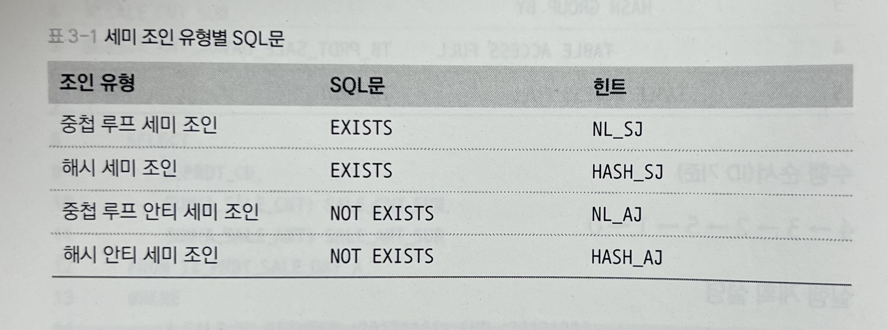

# chapter 03 조인 튜닝 (2)
> 오라클에서 제공하는 조인인 중첩 루프 조인, 해시 조인의 튜닝 기법에 대해 알아보자

## 3.3 세미 조인 튜닝
<br>

### 3.3.1 세미 조인
* 세미조인 이란? 
  * 조인시 특정 조건에 부합된다면 더는 연산을 수행하지 않는 것.  
    EXISTS, NOT EXISTS 를 사용하면 옵티마이저가 세미 조인 사용 여부를 판단하게 됨.  
    특정 조건데 맞으면 더는 반복하지 않고 멈추기 때문에 성능상 유리함.  
    __중첩 루프 세미 조인__, __해시 세미 조인__ 으로 나뉨.

<br>

### 3.3.2 EXISTS문과 NOT EXISTS문
>

<br>

### 3.3.3 세미 조인 튜닝
* 세미 조인 튜닝은 다음 2가지 방법으로 가장 많이 사용됨. 
  * STS 또는 NOT EXISTS 문이 사용된 SQL을 세미 조인으로 유도.
  * UNION 또는 MINUS 집합 연산자가 사용된 SQL문을 세미 조인으로 유도.

<br>

### 3.3.4 서브쿼리 Unnesting
* 서브쿼리는 소괄호 '( )' 로 감싸져 있는데, 옵티마이저는 서브쿼리를 중첩되어(Nesting) 있다고 판단함.  
  중첩된 서브쿼리를 풀어서 메인쿼리와 똑같은 레벨로 위치하게 하는 작업을 '서브쿼리 Unnesting' 이라고 부름.
* 즉, 옵티마이저는 서브쿼리를 메인쿼리와 똑같은 레벨로 위치하게 하는 쿼리 변환을 수행하게 됨.  
  옵티마이저가 서브쿼리 Unnesting을 하는 이유는, 레벨이 같아지면 더 많은 접근경로를 통해 다양한 실행 계획을 도출할 수 있기 때문.
* 반대로, 무조건 필터 조건으로 서브쿼리의 연산이 처리되게 하는 것을 '서브쿼리 No Unnesting' 이라고 함.  

<br>

### 3.3.5 세미 조인 튜닝 관련 힌트

1. NL_SJ 와 HASH_SJ  
    * EXISTS문을 쓴 서브쿼리를 사용할 경우 다음 힌트 사용 가능.  
      - NL_SJ 힌트는 중첩 루프 세미 조인을,  
      - HASH_SJ 힌트는 해시 세미 조인을 유도.

    ```sql
    SELECT  *
    FROM	DEPT
    WHERE	EXISTS ( SELECT  /*+ HASH_SJ */
                             *
                     FROM	 EMP
                     WHERE	 EMP.DEPTNO = DEPT.DEPTNO
                     AND	 SAL > 200000 )
    ;
    ```
   
2. NL_AJ 와 HASH_AJ

    * NOT EXISTS문을 쓴 서브쿼리를 사용할 경우 다음 힌트 사용 가능
      - NL_AJ 힌트는 중첩 루프 안티 세미 조인을,
      - HASJ_AJ 힌트는 해시 안티 세미 조인을 유도.
      
    ```sql
    SELECT  *
    FROM	DEPT
    WHERE	NOT EXISTS ( SELECT  /*+ HASH_AJ */
                                 *
                         FROM    EMP
                         WHERE   EMP.DEPTNO = DEPT.DEPTNO
                         AND     SAL > 200000 )
    ;
    ```

3. UNNEST
    * 서브쿼리 Unnesting 을 유도하는 힌트.
      - 옵티마이저는 더 많은 접근 경로를 가지게 되어 다양한 실행 계획을 평가할 수 있음.

    ```sql
    SELECT  *
    FROM    EMP A
    WHERE   A.SAL > 200000
    AND     EXISTS ( SELECT  /*+ UNNEST */
                             '1'
                     FROM	 DEPT B
                     WHERE	 B.DEPTNO = A.DEPTNO
                     AND	 B.LOC LIKE 'C%' )
    ;
    ```

4. NO UNNEST
    * 서브쿼리 Unnesting을 방지하는 힌트.
      - 옵티마이저는 메인쿼리를 읽으면서 서브쿼리의 조건을 필터 처리하게 됨.

    ```sql
    SELECT  *
    FROM    EMP A
    WHERE   A.SAL > 200000
    AND     EXISTS ( SELECT  /*+ NO_UNNEST */
                             '1'
                     FROM    DEPT B
                     WHERE   B.DEPTNO = A.DEPTNO
                     AND     B.LOC LIKE 'C%' )
    ;
    ```

<br>

### 실습 3-4. 세미 조인 기법을 이용하여 성능 극대화하기

* A. 실습 준비

    ```sql
    CREATE TABLE TB_CUST
    (
        CUST_ID VARCHAR2(10), --고객ID
        CUST_NM VARCHAR2(50) --고객명
    );
  
    CREATE TABLE TB_CUST_DTL
    (
        CUST_ID VARCHAR2(10), -- 고객ID
        SEQ    NUMBER(3), --시퀀스
        CUST_INFO VARCHAR2(150) --고객정보
    );
  
    CREATE TABLE TB_ORD
    (
        ORD_NO VARCHAR2(10), --주문번호
        ORD_DT VARCHAR2(8), --주문일자
        CUST_ID VARCHAR2(10) --고객ID
    );
  
  
    INSERT INTO TB_CUST
    SELECT
        LPAD(TO_CHAR(ROWNUM), 10, '0'),
        DBMS_RANDOM.STRING('U', 50)
    FROM DUAL CONNECT BY LEVEL <= 100000;
    
    COMMIT;
  
    INSERT INTO TB_CUST_DTL
    SELECT
    CUST_ID,
    ROW_NUMBER() OVER (PARTITION BY CUST_ID ORDER BY CUST_ID),
    DBMS_RANDOM.STRING('U', 50)
    FROM TB_CUST, ( SELECT LEVEL LV FROM DUAL CONNECT BY LEVEL <= 10);
  
    COMMIT;
  
    ALTER TABLE TB_ORD NOLOGGING;
  
    INSERT /*+ APPEND */ INTO TB_ORD --APPEND 힌트 사용
    SELECT
    LPAD(TO_CHAR(ROWNUM), 10, '0'),
    TO_CHAR(SYSDATE - TRUNC(DBMS_RANDOM.VALUE(1, 3650)), 'YYYYMMDD'),
    CUST_ID
    FROM TB_CUST, ( SELECT LEVEL LV FROM DUAL CONNECT BY LEVEL <= 50);
  
    COMMIT;
  
    ALTER TABLE TB_CUST
    ADD CONSTRAINT TB_CUST_PK
    PRIMARY KEY (CUST_ID);
  
    ALTER TABLE TB_CUST_DTL
    ADD CONSTRAINT TB_CUST_DTL_PK
    PRIMARY KEY (CUST_ID, SEQ);
  
    ALTER TABLE TB_ORD
    ADD CONSTRAINT TB_ORD_PK
    PRIMARY KEY (ORD_NO);
  
    CREATE INDEX TB_ORD_IDX01 ON TB_ORD(CUST_ID);
  
    ANALYZE TABLE TB_CUST COMPUTE STATISTICS
    FOR TABLE FOR ALL INDEXES FOR ALL INDEXED COLUMNS SIZE 254;
  
    ANALYZE TABLE TB_CUST_DTL COMPUTE STATISTICS
    FOR TABLE FOR ALL INDEXES FOR ALL INDEXED COLUMNS SIZE 254;
  
    ANALYZE TABLE TB_ORD COMPUTE STATISTICS
    FOR TABLE FOR ALL INDEXES FOR ALL INDEXED COLUMNS SIZE 254;
    ```

* B. 튜닝 전 SQL문

    ```sql
    -- 튜닝 전 실행계획 확인
    SELECT 
          /*+ LEADING(A) FULL(A) USE_NL(B) USE_NL(C) */
          A.CUST_ID, 
          A.CUST_NM, 
          B.CUST_ID, 
          B.SEQ, 
          B.CUST_INFO
    FROM 
          TB_CUST A, 
          TB_CUST_DTL B, 
          TB_ORD C
    WHERE
          A.CUST_NM LIKE 'A%' AND
          A.CUST_ID = B.CUST_ID AND
          C.CUST_ID = B.CUST_ID AND
          C.ORD_DT LIKE '2015%' 
    GROUP BY 
          A.CUST_ID, 
          A.CUST_NM, 
          B.CUST_ID, 
          B.SEQ, 
          B.CUST_INFO
    ;
    ```
  
* C. 튜닝 후 SQL문

    ```sql
    SELECT
          /*+ LEADING(A) FULL(A) USE_NL(B) */
          A.CUST_ID,
          A.CUST_NM,
          B.CUST_ID,
          B.SEQ,
          B.CUST_INFO
    FROM
          TB_CUST A, TB_CUST_DTL B
    WHERE
          A.CUST_NM LIKE 'A%' AND
          A.CUST_ID = B.CUST_ID AND
          EXISTS
          (
                SELECT  /*+ UNNEST NL_SJ INDEX(C TB_ORD_IDX01) */
                        '1'
                 FROM   TB_ORD C
                 WHERE  C.CUST_ID = B.CUST_ID AND
                        C.ORD_DT LIKE '2015%'
          ) 
    ;
    ```

* D. 안티 세미 조인
  * EXISTS문을 NOT EXISTS문으로 바꾸면 안티 세미 조인이 성립.

    ```sql
    SELECT
          /*+ LEADING(A) FULL(A) USE_NL(B) */
          A.CUST_ID,
          A.CUST_NM,
          B.CUST_ID,
          B.SEQ,
          B.CUST_INFO
    FROM
          TB_CUST A, TB_CUST_DTL B
    WHERE
          A.CUST_NM LIKE 'A%' AND
          A.CUST_ID = B.CUST_ID AND
          NOT EXISTS
          (   
             SELECT  /*+ UNNEST NL_SJ INDEX(C TB_ORD_IDX01) */
                     '1'
             FROM    TB_ORD C
             WHERE   C.CUST_ID = B.CUST_ID AND
                     C.ORD_DT LIKE '2015%'
          ) 
    ;
    ```
<br>
<br>

---
    
## 3.4 아우터 조인 튜닝
<br>

### 3.4.1 아우터 조인
* 아우터조인 이란? 
  * 테이블 A 와 B 가 있다고 가정할 때, A 테이블을 기준으로 B 테이블이 조인에 성공하면 데이터를 보여주고,  
    조인에 실패하면 B 테이블의 데이터를 보여주지 않는 조인 방식
  * 즉, A 테이블의 내용은 조인 성공여부와 관계없이 무조건 보여주고, B 테이블은 조인 성공시에만 보여주는 방식.  


* Left 아우터 조인
  * Left 아우터 조인은 왼쪽에 명시한 테이블이 기준이 되는 아우터 조인 방식.
  * 아래의 예시에서는 EMP 테이블은 데이터를 모두 보여주고, DEPT 테이블은 조인이 성공한 데이터만 보여줌.
  ```sql
  SELECT  *
  FROM    EMP 
  LEFT OUTER JOIN DEPT
  ON      (EMP.DEPTNO = DEPT.DEPTNO)
  ;
  ```
  
* Right 아우터 조인
  * Right 아우터 조인은 오른쪽에 명시한 테이블이 기준이 되는 아우터 조인 방식.
  * 아래의 예시에서는 EMP 테이블은 데이터를 모두 보여주고, DEPT 테이블은 조인이 성공한 데이터만 보여줌.
  ```sql
  SELECT  *
  FROM    DEPT 
  RIGHT OUTER JOIN EMP
  ON      (DEPT.DEPTNO = EMP.DEPTNO)
  ;
  ```
<br>

### 3.4.2 LEFT 아우터 조인
* A 테이블을 기준으로 B 테이블과 조인하고,
* A 테이블의 모든 데이터는 출력이 보장되며, B 테이블의 테이터는 조인에 성공한 것만 보여줌.

  ```sql
  SELECT  *
  FROM    A
  LEFT OUTER JOIN B
  ON      A.NO = B.NO
  ;
  ```
<br>

### 3.4.3 RIGHT 아우터 조인
* B 테이블을 기준으로 A 테이블과 조인하고,
* B 테이블의 모든 데이터는 출력이 보장되며, A 테이블의 테이터는 조인에 성공한 것만 보여줌.

  ```sql
  SELECT  *
  FROM    A
  RIGHT OUTER JOIN B
  ON      B.NO = A.NO
  ;
  ```
<br>

### 3.4.4 아우터 조인 튜닝
* 아우터 조인으로 구현된 SQL문의 성능을 극대화하는 일련의 모든 활동을 의미.
* 다음 두 가지 경우에 아우터 조인 튜닝이 가능.  
<br>
#### 1. 아우터 조인을 이용하여 <u>**테이블 스캔 최소화**</u>
   - 테이블 A, B, C가 있다고 가정할때, A = B + C 의 관계가 성립할 경우,
     B, C는 A에 대하여 베타적 관계에 있다고 할 수 있음.
   - 테이블 A를 기준으로 테이블 B, C를 각각 조인할 때 UNION ALL문을 사용하여 두 개의 SELECT 문의 합집합을 구하게 되는데,
   - 이러한 경우 UNION ALL 문을 아우터 조인으로 변환하여 성능을 개선. (가장 큰 테이블인 A를 단 한번만 스캔하는 것이 핵심)  
<br>  
#### 2. 아우터 조인을 <u>**스칼라 서브쿼리로 변환**</u>
   - 오라클에서는 스칼라 서브쿼리로 한 번 이상 호출된 Input/Outpit 값을 멀티 버퍼에 저장해 둔 후  
     동일한 Input으로 호출되면 기존에 가지고있던 Output 값을 바로 리턴하는 스칼라 서브쿼리 캐싱 기능이 있음.
   - 이러한 오라클의 기능을 활용하여 아우터 조인을 스칼라 서브쿼리로 변환하면 성능을 극대화할 수 있음.

<br>

### 실습 3-5. 아우터 조인으로 테이블 스캔을 최소화하여 성능 개선하기

* A. 실습 준비

    ```sql
    CREATE TABLE TB_JOB_ORDER
    (
    	JOB_NO VARCHAR2(10),
    	VISIT_PRE_DT VARCHAR2(8),
    	WORKER_ID VARCHAR2(10),
    	JOB_STATUS_CD VARCHAR2(2),
    	JOB_GUBUN VARCHAR2(1),
    	REQ_NO VARCHAR2(10),
    	INST_DTM DATE,
    	INST_ID VARCHAR2(50)
    );
    
    CREATE TABLE TB_OPEN_REQ
    (
    	OPEN_REQ_NO VARCHAR2(10),
    	OPEN_REQ_DT VARCHAR2(8),
    	OPEN_HOPE_DT VARCHAR2(8),
    	CUST_NO VARCHAR2(10),
    	INST_DTM DATE,
    	INST_ID VARCHAR2(50)
    );
    
    CREATE TABLE TB_DISABLE_REQ
    (
    	DISABLE_REQ_NO VARCHAR2(10),
    	DISABLE_REQ_DT VARCHAR2(8),
    	DISABLE_DTM DATE,
    	CUST_NO VARCHAR2(10),
    	INST_DTM DATE,
    	INST_ID VARCHAR2(50)
    );
    
    INSERT INTO TB_OPEN_REQ
    SELECT
    	LPAD(TO_CHAR(ROWNUM), 10, '0'),
    	RANDOM_DT,
    	TO_CHAR(TO_DATE(RANDOM_DT, 'YYYYMMDD') +  DBMS_RANDOM.VALUE(1, 30), 'YYYYMMDD'),
    	LPAD(TO_CHAR(TRUNC(DBMS_RANDOM.VALUE(1, 10000))), 10, '0'),
    	SYSDATE,
    	'DBMSEXPERT'
    FROM
    (
    SELECT
    	TO_CHAR(SYSDATE - DBMS_RANDOM.VALUE(1, 3650), 'YYYYMMDD') RANDOM_DT
    FROM DUAL
    ) A, DUAL CONNECT BY LEVEL <= 1000000;
    
    COMMIT;
    
    INSERT INTO TB_DISABLE_REQ
    SELECT
    	LPAD(TO_CHAR(ROWNUM), 10, '0'),
    	RANDOM_DT,
    	TO_DATE(RANDOM_DT||TO_CHAR(SYSDATE-864000/24/60/60, 'HH24MISS'), 'YYYYMMDDHH24MISS'),
    	LPAD(TO_CHAR(TRUNC(DBMS_RANDOM.VALUE(1, 10000))), 10, '0'),
    	SYSDATE,
    	'DBMSEXPERT'
    FROM
    (
    SELECT
    	TO_CHAR(SYSDATE - DBMS_RANDOM.VALUE(1, 3650), 'YYYYMMDD') RANDOM_DT
    FROM DUAL
    ) A, DUAL CONNECT BY LEVEL <= 1000000;
    
    COMMIT;
    
    
    INSERT /*+ APPEND */ INTO TB_JOB_ORDER
    SELECT
    	 LPAD(TO_CHAR(ROWNUM), 10, '0'),
    	 TO_CHAR(SYSDATE - DBMS_RANDOM.VALUE(1, 3650), 'YYYYMMDD'),
       LPAD(TO_CHAR(TRUNC(DBMS_RANDOM.VALUE(1, 10000))), 10, '0'),
       LPAD(TO_CHAR(TRUNC(MOD(DBMS_RANDOM.VALUE(1, 10000), 10))), 2, '0'),
       JOB_GUBUN,
       REQ_NO,
       SYSDATE,
    	 'DBMSEXPERT'
    FROM DUAL,
    (SELECT '1' JOB_GUBUN, OPEN_REQ_NO REQ_NO
    FROM TB_OPEN_REQ
    UNION ALL
    SELECT
    	'2' JOB_GUBUN, DISABLE_REQ_NO REQ_NO
    FROM TB_DISABLE_REQ
    ) A;
    
    COMMIT;
    
    ALTER TABLE TB_JOB_ORDER
    ADD CONSTRAINT TB_JOB_ORDER_PK
    PRIMARY KEY (JOB_NO);
    
    ALTER TABLE TB_OPEN_REQ
    ADD CONSTRAINT TB_OPEN_REQ_PK
    PRIMARY KEY (OPEN_REQ_NO);
    
    ALTER TABLE TB_DISABLE_REQ
    ADD CONSTRAINT TB_DISABLE_REQ_PK
    PRIMARY KEY (DISABLE_REQ_NO);
    
    ANALYZE TABLE TB_JOB_ORDER COMPUTE STATISTICS 
    FOR TABLE FOR ALL INDEXES FOR ALL INDEXED COLUMNS SIZE 254;
    
    ANALYZE TABLE TB_OPEN_REQ COMPUTE STATISTICS FOR TABLE 
    FOR ALL INDEXES FOR ALL INDEXED COLUMNS SIZE 254;
    
    ANALYZE TABLE TB_DISABLE_REQ COMPUTE STATISTICS FOR TABLE 
    FOR ALL INDEXES FOR ALL INDEXED COLUMNS SIZE 254;
    ```

* B. 튜닝 전 상황

    ```sql
    SELECT  A.JOB_NO, A.WORKER_ID, A.JOB_STATUS_CD, A.REQ_NO
    FROM    TB_JOB_ORDER A
          , TB_OPEN_REQ  B
    WHERE   A.VISIT_PRE_DT = '20151102'
    AND     A.JOB_GUBUN    = '1'
    AND     A.REQ_NO       = B.OPEN_REQ_NO
    UNION ALL
    SELECT  A.JOB_NO, A.WORKER_ID, A.JOB_STATUS_CD, A.REQ_NO
    FROM    TB_JOB_ORDER   A
          , TB_DISABLE_REQ B
    WHERE   A.VISIT_PRE_DT = '20151102'
    AND     A.JOB_GUBUN    = '2'
    AND     A.REQ_NO       = B.DISABLE_REQ_NO;
    ```

* C. 튜닝

    ```sql
    SELECT  
            /*+ LEADING(A) USE_NL(B) USE_NL(C) */
            A.JOB_NO, A.WORKER_ID, A.JOB_STATUS_CD, A.REQ_NO
    FROM    TB_JOB_ORDER   A
          , TB_OPEN_REQ    B
          , TB_DISABLE_REQ C
    WHERE   A.VISIT_PRE_DT = '20151102'
    AND     DECODE(A.JOB_GUBUN, '1', A.REQ_NO) = B.OPEN_REQ_NO(+)
    AND     DECODE(A.JOB_GUBUN, '2', A.REQ_NO) = C.DISABLE_REQ_NO(+);
    ```

<br>

### 실습 3-6. 아우터 조인을 스칼라 서브쿼리 방식으로 변환하여 성능 극대화하기

* A. 실습 준비

    ```sql
    CREATE TABLE TB_TRD_DAY
    (
        TRD_DT VARCHAR2(8), --거래일자
        INSU_CD    VARCHAR2(4), --인수코드
        INSU_DETAIL_CD VARCHAR2(6), --인수상세코드
        TRD_CNT    NUMBER, --거래건수
        CNCL_CNT NUMBER, --취소건수
        EXPORTER_NO    VARCHAR2(10) --수출자번호
    );
    
    CREATE TABLE TB_EXPORTER
    (
        EXPORTER_NO    VARCHAR2(10), --수출자번호
        EXPORTER_NM VARCHAR2(50) --수출자명
    );
    
    INSERT INTO TB_EXPORTER
    SELECT
    LPAD(TO_CHAR(ROWNUM), 10, '0'),
    DBMS_RANDOM.STRING('U', 50)
    FROM DUAL CONNECT BY LEVEL <= 100000;
    
    COMMIT;
    
    ALTER TABLE TB_TRD_DAY NOLOGGING;
    
    INSERT /*+ APPEND */ INTO TB_TRD_DAY A -- APPEND 힌트 사용
    SELECT
    TO_CHAR(SYSDATE - TRUNC(DBMS_RANDOM.VALUE(0, 3650)), 'YYYYMMDD'),
    LPAD(TO_CHAR(TRUNC(DBMS_RANDOM.VALUE(1, 9999))), 4, '0'),
    LPAD(TO_CHAR(ROWNUM), 6, '0'),
    TRUNC(DBMS_RANDOM.VALUE(1, 999)),
    TRUNC(DBMS_RANDOM.VALUE(1, 999)),
    B.EXPORTER_NO
    FROM TB_EXPORTER B ,(SELECT LEVEL LV FROM DUAL CONNECT BY LEVEL <= 10);
    
    COMMIT;
    
    ALTER TABLE TB_TRD_DAY
    ADD CONSTRAINT TB_TRD_DAY_PK
    PRIMARY KEY (TRD_DT, INSU_CD, INSU_DETAIL_CD);
    
    ALTER TABLE TB_EXPORTER
    ADD CONSTRAINT TB_EXPORTER_PK 
    PRIMARY KEY (EXPORTER_NO);
    
    ANALYZE TABLE TB_EXPORTER COMPUTE STATISTICS
    FOR TABLE FOR ALL INDEXES FOR ALL INDEXED COLUMNS SIZE 254;
    
    ANALYZE TABLE TB_TRD_DAY COMPUTE STATISTICS
    FOR TABLE FOR ALL INDEXES FOR ALL INDEXED COLUMNS SIZE 254;
    ```


* B. 튜닝 전 상황

    ```sql
    SELECT  /*+ LEADING(A) USE_NL(B) INDEX(A TB_TRD_DAY_PK) */
            A.EXPORTER_NO
          , B.EXPORTER_NM
          , SUM(A.TRD_CNT - A.CNCL_CNT) TOT_CNT
    FROM    TB_TRD_DAY A 
    LEFT OUTER JOIN TB_EXPORTER B
    ON      ( A.EXPORTER_NO = B.EXPORTER_NO )
    AND     A.TRD_DT BETWEEN '20100101' AND '20151231'
    GROUP BY 
            A.EXPORTER_NO
          , B.EXPORTER_NM
    ORDER BY 
            A.EXPORTER_NO;
    ```


* C. 튜닝

    ```sql
    SELECT  X.EXPORTER_NO
          , ( SELECT  B.EXPORTER_NM
              FROM    TB_EXPORTER B
              WHERE   B.EXPORTER_NO = X.EXPORTER_NO )
          , TOT_CNT
    FROM    ( SELECT  A.EXPORTER_NO
                    , SUM(A.TRD_CNT-A.CNCL_CNT) TOT_CNT
              FROM    TB_TRD_DAY A
              WHERE   A.TRD_DT BETWEEN '20100101' AND '20151231'
              GROUP BY 
                      A.EXPORTER_NO
              ORDER BY 
                      A.EXPORTER_NO ) X 
    ;
    ```


