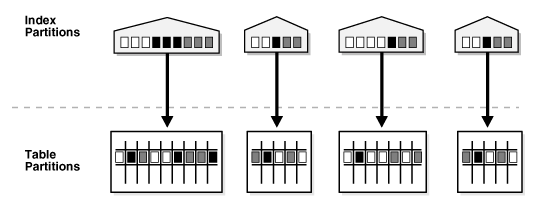
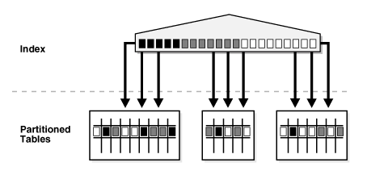

# Chapter 06 "파티셔닝 튜닝"

## 6-1 파티셔닝 

* 파티셔닝은 대룡량의 큰 테이블을 여러 단위로 나누어 사용하고 관리하는 기법
* 대용량의 테이블을 하나의 테이블로만 관리할 경우 테이블 사용 불능 상태에서 전체 데이터를 모두 사용하지 못하는 문제 발생
* 파티셔닝 장점
  * 백업과 복구가 쉬움
  * 테이블 내의 특정 파티션에 문제가 발생했을 때 다른 파티션에 영향을 주지 않음
  * 테이블 액세스 시 스캔 범위를 줄여 성능 향상을 가져옴

## 6-2 파티션 프루닝
* 파티셔닝 컬럼이 조건절에 조건으로 들어왔을 때 해당 파티션만 읽고 대상이 아닌 파티션을 스캔하지 않는 기법

### 실습 1
* 파티셔닝 생성 불가 : https://linuxforge.tistory.com/74
```sql 
-- 테이블 생성
CREATE TABLE TB_TRD
(
    TRD_NO VARCHAR2(15), --거래번호
    TRD_DT VARCHAR2(8), --거래일자
    TRD_AMT NUMBER(15), --거래금액
    CUST_ID VARCHAR2(10), --고객ID
    PRDT_CD VARCHAR2(6), --상품코드
    INST_ID VARCHAR2(50), --입력자ID
    INST_DTM DATE --입력일시
)

-- TRD_DT 컬럼 기준으로 파티셔닝 
PARTITION BY RANGE(TRD_DT)
(
    PARTITION P_TB_TRD_201409 VALUES LESS THAN ('20141001'),
    PARTITION P_TB_TRD_201410 VALUES LESS THAN ('20141101'),
    PARTITION P_TB_TRD_201411 VALUES LESS THAN ('20141201'),
    PARTITION P_TB_TRD_201412 VALUES LESS THAN ('20150101'),
    PARTITION P_TB_TRD_201501 VALUES LESS THAN ('20150201'),
    PARTITION P_TB_TRD_201502 VALUES LESS THAN ('20150301'),
    PARTITION P_TB_TRD_201503 VALUES LESS THAN ('20150401'),
    PARTITION P_TB_TRD_201504 VALUES LESS THAN ('20150501'),
    PARTITION P_TB_TRD_201505 VALUES LESS THAN ('20150601'),
    PARTITION P_TB_TRD_201506 VALUES LESS THAN ('20150701'),
    PARTITION P_TB_TRD_201507 VALUES LESS THAN ('20150801'),
    PARTITION P_TB_TRD_201508 VALUES LESS THAN ('20150901'),
    PARTITION P_TB_TRD_201509 VALUES LESS THAN ('20151001'),
    PARTITION P_TB_TRD_MAX  VALUES LESS THAN (MAXVALUE)
);


-- 데이터 입력 
CREATE TABLE DUAL_10 (DUMMY VARCHAR2(1));

INSERT INTO DUAL_10
SELECT 'X' FROM DUAL CONNECT BY LEVEL <= 10;

COMMIT;

ALTER TABLE TB_TRD NOLOGGING;

INSERT /*+ APPEND */  INTO TB_TRD --APPEND 힌트 사용
SELECT
  LPAD(TO_CHAR(ROWNUM), 15, '0'),
  TO_CHAR(SYSDATE - TRUNC(DBMS_RANDOM.VALUE(1, 365)), 'YYYYMMDD'),
  TRUNC(DBMS_RANDOM.VALUE(1000, 100000)),
  LPAD(TO_CHAR(TRUNC(DBMS_RANDOM.VALUE(0, 100000))), 10, '0'),
  LPAD(TO_CHAR(TRUNC(DBMS_RANDOM.VALUE(0, 10000))), 6, '0'),
  'DBMSEXPERT',
  SYSDATE
FROM DUAL_10, ( SELECT LEVEL LV FROM DUAL CONNECT BY LEVEL <= 1000000);

COMMIT; 

-- 기본키 생성
ALTER TABLE TB_TRD
ADD CONSTRAINT TB_TRD_PK 
PRIMARY KEY(TRD_NO);

-- 통계정보 생성
ANALYZE TABLE TB_TRD COMPUTE STATISTICS
FOR TABLE FOR ALL INDEXES FOR ALL INDEXED COLUMNS SIZE 254;

```

* 튜닝 전 
  * 묵시적 형변환으로 파티션 프루닝이 되지 않고, 불필요한 파티션까지 모두 스캔 -> PARTITION RANGE ALL
```sql
SELECT *
FROM TB_TRD
WHERE TRD_DT -- VARCHAR2로 DATE 타입과 비교하며 DATE 타입으로 형변환
BETWEEN TO_DATE(TO_CHAR(SYSDATE - 180, 'YYYYMMDD'), 'YYYYMMDD') 
AND TO_DATE(TO_CHAR(SYSDATE - 120, 'YYYYMMDD'), 'YYYYMMDD');

```

* 튜닝 후
  * 같은 데이터 타입 간의 비교 연산이 이루어지므로 파티션 프루닝 가능 -> PARTITION RANGE ITERATOR
```sql
SELECT *
FROM TB_TRD
WHERE TRD_DT 
BETWEEN TO_CHAR(SYSDATE - 180, 'YYYYMMDD')
AND TO_CHAR(SYSDATE - 120, 'YYYYMMDD');
```

## 6.3 파티션 인덱스 튜닝

### 6.3.1 파티션 인덱스 종류


* 로컬 파티션 인덱스
  
  * 파티션 테이블에서 사용하는 가장 일반적인 INDEX 생성 방법으로 테이블과 인덱스가 동일하게 파티션 된 경우, 1:1
  * 로컬 인덱스는 테이블 파티션 키 컬럼을 똑같이 인덱스로 구성
  * 로컬 파티션 인덱스의 경우에는 테이블의 파티션 구조가 바뀐다거나 파티션이 삭제가 된다고 하더라도 인덱스 재생성이 필요가 없이 오라클에서 알아서 자동으로 관리를 해주기 때문에 관리측면에서 유리
  ```sql
  CREATE INDEX YEAR_IDX
  ON ALL_FACT (ORDER_DATE)
  LOCAL
  (PARTITION NAME_IDX1),
  (PARTITION NAME_IDX2),
  (PARTITION NAME_IDX3)
  ```
  
* 글로벌 파티션 인덱스
  
  * 파티션 테이블로 이루어져 있는 테이블에 하나의 인덱스가 여러 개의 테이블 파티션과 매핑
  * 글로벌 인덱스는 파티션 키 컬럼을 인덱스로 지정해주어야 하는 로컬 인덱스와는 달리 다른 컬럼들도 자유롭게 인덱스를 걸 수 있다는 장점이 있음
  ```
  CREATE INDEX ITEM_IDX
  ON ALL_FACT (ITEM_NBR)
  GLOBAL
  (PARTITION CITY_IDX1 VALUES LESS THEN (100)),
  (PARTITION CITY_IDX1 VALUES LESS THEN (200)),
  (PARTITION CITY_IDX1 VALUES LESS THEN (300)),
  (PARTITION CITY_IDX1 VALUES LESS THEN (400)),
  (PARTITION CITY_IDX1 VALUES LESS THEN (500))
  ```

### 6.3.2 파티션 인덱스 생성 방식

* 프리픽스 파티션 인덱스
  * 파티셔닝 테이블의 파티션 키 컬럼이 파티션 이덱스 컬럼구성에서 인덱스 선두에 오는 것
* 논 프리픽스 파티션 인덱스
  * 파티셔닝 테이블의 파티션 키 컬럼이 파티션 인덱스 컬럼 구성에서 선두에 오지 않는 것을 뜻


### 6.3.3 파티션 인덱스 유형


### 6.3.4 파티션 인덱스 튜닝
* 파티셔닝된 테이블에 파티션 인덱스를 생성하여 검색속도를 극적으로 단축하는 것. 

### 실습 2

```
--테이블 및 파티션 생성
CREATE TABLE TB_TRD
(
    TRD_NO VARCHAR2(15), --거래번호
    TRD_DT VARCHAR2(8), --거래일자
    TRD_AMT NUMBER(15), --거래금액
    CUST_ID VARCHAR2(10), --고객ID
    PRDT_CD VARCHAR2(6), --상품코드
    INST_ID VARCHAR2(50), --입력자ID
    INST_DTM DATE --입력일시
)
PARTITION BY RANGE(TRD_DT)
(
    PARTITION P_TB_TRD_201409 VALUES LESS THAN ('20141001'),
    PARTITION P_TB_TRD_201410 VALUES LESS THAN ('20141101'),
    PARTITION P_TB_TRD_201411 VALUES LESS THAN ('20141201'),
    PARTITION P_TB_TRD_201412 VALUES LESS THAN ('20150101'),
    PARTITION P_TB_TRD_201501 VALUES LESS THAN ('20150201'),
    PARTITION P_TB_TRD_201502 VALUES LESS THAN ('20150301'),
    PARTITION P_TB_TRD_201503 VALUES LESS THAN ('20150401'),
    PARTITION P_TB_TRD_201504 VALUES LESS THAN ('20150501'),
    PARTITION P_TB_TRD_201505 VALUES LESS THAN ('20150601'),
    PARTITION P_TB_TRD_201506 VALUES LESS THAN ('20150701'),
    PARTITION P_TB_TRD_201507 VALUES LESS THAN ('20150801'),
    PARTITION P_TB_TRD_201508 VALUES LESS THAN ('20150901'),
    PARTITION P_TB_TRD_201509 VALUES LESS THAN ('20151001'),
    PARTITION P_TB_TRD_MAX    VALUES LESS THAN (MAXVALUE)
);

-- 데이터 입력
CREATE TABLE DUAL_10 (DUMMY VARCHAR2(1));

INSERT INTO DUAL_10
SELECT 'X' FROM DUAL CONNECT BY LEVEL <= 10;

COMMIT;

ALTER TABLE TB_TRD NOLOGGING;

INSERT /*+ APPEND */  INTO TB_TRD --APPEND 힌트 사용
SELECT
    LPAD(TO_CHAR(ROWNUM), 15, '0'),
    TO_CHAR(SYSDATE - TRUNC(DBMS_RANDOM.VALUE(1, 365)), 'YYYYMMDD'),
    TRUNC(DBMS_RANDOM.VALUE(1000, 100000)),
  LPAD(TO_CHAR(TRUNC(DBMS_RANDOM.VALUE(0, 100000))), 10, '0'),
  LPAD(TO_CHAR(TRUNC(DBMS_RANDOM.VALUE(0, 10000))), 6, '0'),
  'DBMSEXPERT',
  SYSDATE
FROM DUAL_10, ( SELECT LEVEL LV FROM DUAL CONNECT BY LEVEL <= 1000000);

COMMIT; 

--기본키 생성
ALTER TABLE TB_TRD
ADD CONSTRAINT TB_TRD_PK 
PRIMARY KEY(TRD_NO);

-- 통계정보 생성
ANALYZE TABLE TB_TRD COMPUTE STATISTICS
FOR TABLE FOR ALL INDEXES FOR ALL INDEXED COLUMNS SIZE 254;

```

* 튜닝 전
  * 파티셔닝 컬럼이 TRD_DT조건으로 들어가 파티션 프루닝이 되지만 해당 파티션을 풀 스캔 하는 문제점이 있음
```
SELECT *
FROM TB_TRD
WHERE CUST_ID = '0000000001'
AND TRD_DT BETWEEN TO_CHAR(SYSDATE - 365, 'YYYYMMDD') AND TO_CHAR(SYSDATE, 'YYYYMMDD');

```

* 튜닝 후 
  * CUST_ID + TRD_DT 컬럼으로 구성된 로컬 파티션 인덱스 생성 -> 인덱스 범위 스캔
```
  CREATE INDEX TB_TRD_IDX01 ON TB_TRD (CUST_ID, TRD_DT) LOCAL;
  
  ANALYZE INDEX TB_TRD_IDX01 COMPUTE STATISTICS;

  SELECT *
  FROM TB_TRD
  WHERE CUST_ID = '0000000001'
  AND TRD_DT BETWEEN TO_CHAR(SYSDATE - 365, 'YYYYMMDD') AND TO_CHAR(SYSDATE, 'YYYYMMDD');
```


  


